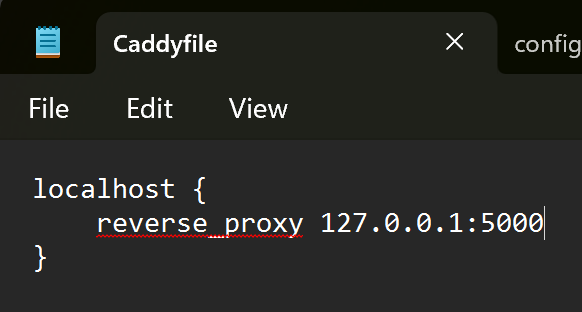
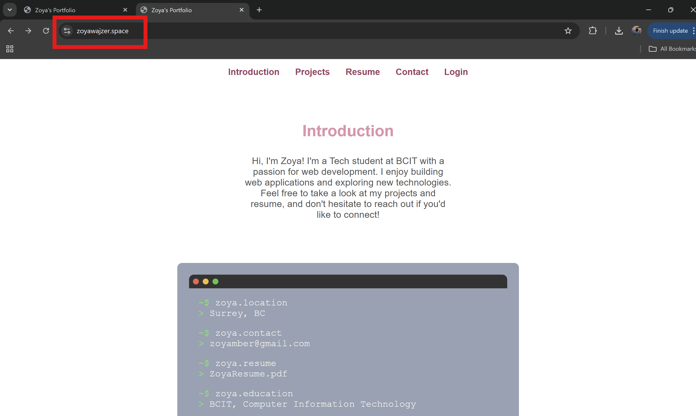

# **ACIT 3475 Project 1:**

## Research and Deployment of a Professional Portfolio Web Server

Zoya Wajzer

A01370534


## **Introduction**


In this project, I will research and deploy the Caddy web server both locally and on the cloud, while building my professional portfolio website. The portfolio will feature my resume and three completed projects, showcasing my skills.

### **The project is divided into three main parts:**

1. [Research and Presentation](#part-one-resarch-and-presentation)

2. [Local Deployment and Portfolio Setup](#park-two-local-deployment-and-portfolio-setup) 

3. [Cloud Deployment and Domain Setup](#park-three-cloud-deployment-and-domain-setup)

## Part One: Resarch and Presentation

In this part, I researched Caddy’s key features, use cases, and compared it with Apache and Nginx. 

I created a 10 minute video presentation which [can be accessed here](https://youtu.be/rtQ6WrAxsLY)


## Park Two: Local Deployment and Portfolio Setup 

In Part 2, I installed Caddy locally on my machine. I then built a portfolio website using HTML, CSS, and JavaScript, featuring sections for my projects and resume. For the backend, I used Flask to handle login and session management. Finally, I configured Caddy to serve the website locally by writing a Caddyfile that includes reverse proxy and static file serving setups.

**Step 1: Download Caddy**

first we need to download Caddy from the official website.

[Click here to access the website](https://caddyserver.com/download)


**Step 2: Create folder** 

After you have installed Caddy, open your file explorer and locate your C drive

Create a folder inside the C drive called "Caddy"


**Step 3: Move file**

next, we move the downloaded caddy file into our newly created folder.

After, open powershell and run thses commands:

```
cd C:\Caddy

.\caddy version
```

It should look something like this:


**Step 4: Config File**

Next, we create a caddy file within the Caddy folder and add configuration. 

It should look like this:




**Step 5: Run Caddy**

Open powershell and run the command:

```
.\caddy.exe run
```

The results should look something like this


**Step 6: Verification**

visit `https://localhost/` to verify that the application is hosted locally


Part two successfully completed!


## Park Three: Cloud Deployment and Domain Setup

In part 3, I set up a cloud instance using AWS EC2, launching an Ubuntu instance, and configuring security groups/firewalls for HTTP/HTTPS traffic. I then installed and configured Caddy on the cloud instance, ensuring it is publicly accessible. After registering a domain and pointing it to the cloud instance via DNS records, I enabled HTTPS in the Caddyfile for automatic SSL certificate setup. Finally, I deployed the portfolio website from Part 2 to the cloud instance, test its functionality, and troubleshoot any issues.

**Step 1: AWS EC2 Instance**

Log Into AWS and go to the EC2 dahsboard.

Press Instances, and create new instance.

Configure as follows:

```
Instance type: t2.micro

OS: Ubuntu Server 24.04 LTS

Security group:
 - SSH: 22
 - HTTP: 80
 - HTTPS: 443
```
Create Instance

**Step 2: Log in**

Open powershell and loginto your instance using SSH

```
ssh -i "linux.pem" ubuntu@ec2-44-203-65-200.compute-1.amazonaws.com
```


**Step 3: Install Caddy**

Run these set of commands to download Caddy and Its Dependencies:

```
sudo apt install -y debian-keyring debian-archive-keyring apt-transport-https curl

curl -1sLf 'https://dl.cloudsmith.io/public/caddy/stable/gpg.key' | sudo gpg --dearmor -o /usr/share/keyrings/caddy-stable-archive-keyring.gpg

curl -1sLf 'https://dl.cloudsmith.io/public/caddy/stable/debian.deb.txt' | sudo tee /etc/apt/sources.list.d/caddy-stable.list

sudo apt update

sudo apt install caddy
```

**Step 4: Verify Caddy status**

run:
```
sudo systemctl status caddy
```

Output should look something like the image below


**Step 5: Transfer Project Files**

Open a new Powershell terminal and run the command: 

```
scp -i C:/Users/zoyam/Downloads/linux.pem -r MyApp ubuntu@44.203.65.200:~
```

This transfers all files from my local machine to the home directory of the cloud instance.

If successfull, output should look like this: 


**Step 6: Install Python and Pip**

Run the command:

```
sudo apt update && sudo apt install -y python3 python3-pip
```

**Step 7: Create a virtual environment**

Run:

```
sudo apt install -y python3-venv

python3 -m venv venv

source venv/bin/activate
```

**Step 8: Install Flask and Gunicorn**

Run this command:

```
pip install flask-session gunicorn
```

**Step 9: Purchase Domain**

To proceed with the next steps, you need to purchase a domain and configure `route53` on AWS.

I used namecheap, and purchased my domain named `zoyawajzer.space`

Navigate to `Route53` on AWS and select `Hosted Zones`

Create a hosted zone and under Domain name use the domain name you have just purchased, and leave all other settings.

create the hosted zone.


**Step 10: Create new Record**

Select your new hosted zone, and click `Create record`

Make sure the record type is `A` and paste your Public Ip from your Ec2 Instance into `Value/Route traffic to`

press Define simple record

you should now have 3 records listed:


> **Note:** Copy all name servers into namecheap under `NAMESERVERS`.


**Step 11: Configure CaddyFile**

configure the caddy file:


Then restart caddy running:

```
sudo systemctl restart caddy
```

**Step 12: Run Gunicorn**

```
gunicorn -w 4 -b 0.0.0.0:5000 app:app
```

**Step 13: Set Up Gunicorn as a Systemd Service**

run:

```
sudo nano /etc/systemd/system/gunicorn.service
```

next configure the file so it looks like the image below


**Step 14: Run Gunicorn**

```
sudo systemctl daemon-reload

sudo systemctl start gunicorn

sudo systemctl enable gunicorn
```

**Step 15: Check Status**

Run, `sudo systemctl status gunicorn`

Output should verify it is running correctly


**Step 16: Final Result**

After all the steps are completed verify that your site is running correctly.

visit `https://zoyawajzer.space/`

click [here](https://zoyawajzer.space/) to access my site


It should look like this:



**YAY!**  I have successfully deployed my portfolio website using AWS and caddy